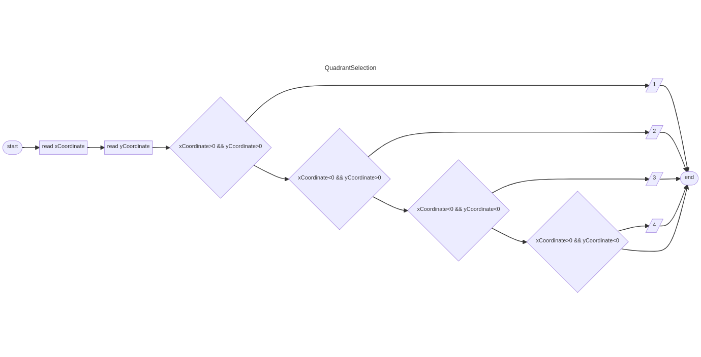
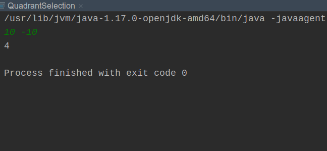

# Last Factorial Digit

The factorial of an integer N, denoted as N!, is defined as the product of all numbers from 1 to N including N. For example 5! = 5 * 4 * 3 * 2 * 1 = 120.

The factorial of a number that is large can be even larger, so in this exercise only the last digit of N! will be shown.
Keeping in mind that N is in base 10.
## Input

In the first input line is an integer N representing the test cases, followed by N lines with a positive integer T (1< T < 10 ) to be the number to which the factorial should be calculated.
## Output

For each test case only one integer should be printed, which will be the last digit of the T-number of the test case.


| Sample Input 1 | Sample Output 1 |
|----------------|-----------------|
| 3              |                 |
| 3              | 6               |
| 5              | 0               |
| 1              | 1               |


## Workflow

```
---
title: QuadrantSelection
---
flowchart LR
start([start])
start --> readA[read xCoordinate]
readA --> readB[read yCoordinate]
readB --> C{xCoordinate>0 && yCoordinate>0}
C -->  print1[/ 1 /]
print1 --> nd([end])
C --> D{xCoordinate<0 && yCoordinate>0}
D --> print2[/ 2 /]
print2 --> nd([end])
D --> E{xCoordinate<0 && yCoordinate<0}
E --> print3[/ 3 /]
print3 --> nd([end])
E --> F{xCoordinate>0 && yCoordinate<0}
F --> print4[/ 4 /]
print4 --> nd([end])
F --> nd
```


## Execution



