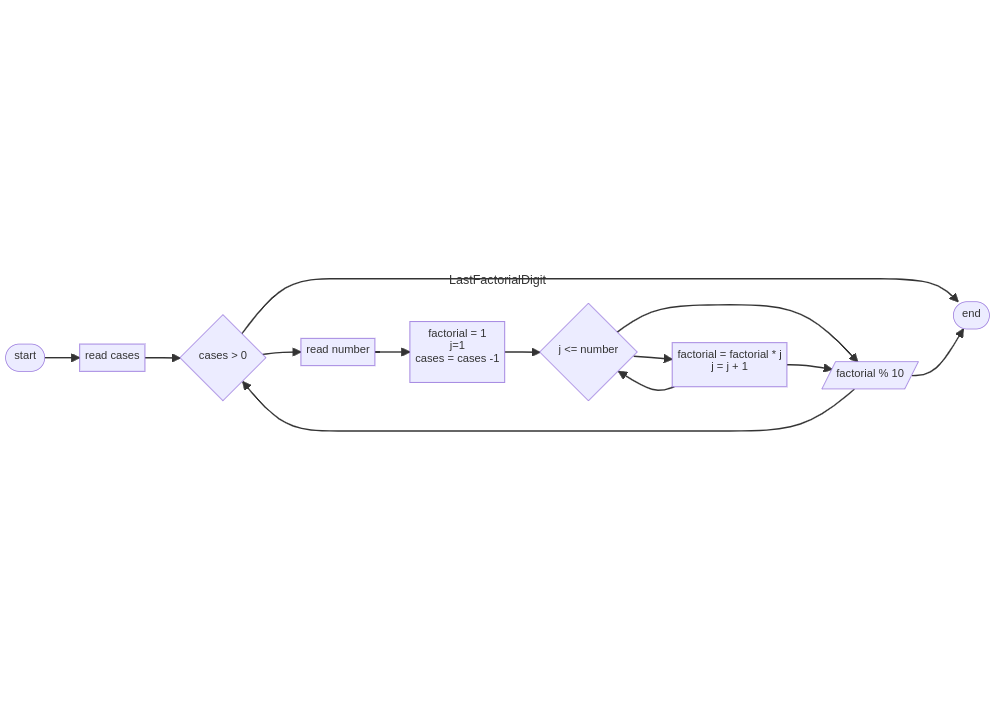
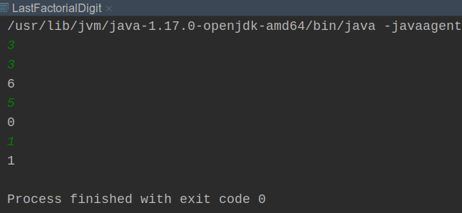

# Last Factorial Digit

The factorial of an integer N, denoted as N!, is defined as the product of all numbers from 1 to N including N. For example 5! = 5 * 4 * 3 * 2 * 1 = 120.

The factorial of a number that is large can be even larger, so in this exercise only the last digit of N! will be shown.
Keeping in mind that N is in base 10.
## Input

In the first input line is an integer N representing the test cases, followed by N lines with a positive integer T (1< T < 10 ) to be the number to which the factorial should be calculated.
## Output

For each test case only one integer should be printed, which will be the last digit of the T-number of the test case.


| Sample Input 1 | Sample Output 1 |
|----------------|-----------------|
| 3              |                 |
| 3              | 6               |
| 5              | 0               |
| 1              | 1               |


## Workflow

```
---
title: LastFactorialDigit
---
flowchart LR
start([start])
start --> readCases[read cases]
readCases --> A{cases > 0}
A --> readNumber[read number]
A --> nd([end])
readNumber --> fact[factorial = 1 \n j=1 \n cases = cases -1]
fact --> B{j <= number}
B --> recalculate[factorial = factorial * j\nj = j + 1]
recalculate --> B
B --> printAns[/ factorial % 10/]
recalculate --> printAns[/ factorial % 10/]
printAns --> A
printAns --> nd([end])
```


## Execution



