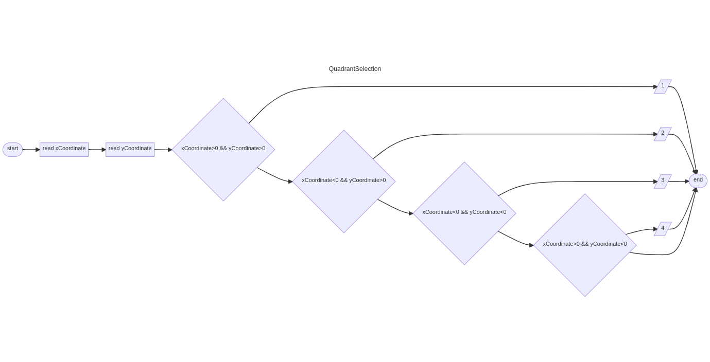
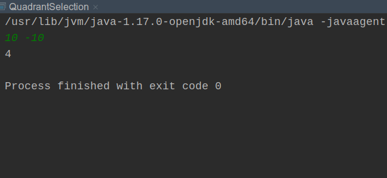

# Quadrant Selection

To find the quadrant where a point lies in a two-dimensional Cartesian plane, it can be determined by its X and Y coordinates.
## Input

The first line consists of the integer number of the first X coordinate where (-1000 < X < 1000, N != 0) followed by the line where the integer value of the Y coordinate is found (-1000 < Y < 1000, y != 0).
## Output

The output will print the quadrant to which the entered point belongs (X, Y), either 1, 2, 3 or 4.


| Sample Input 1 | Sample Output 1 |
|----------------|-----------------|
| 10 6           | 2               |
| -12 5          | 1               |
| -1 -1          | 3               |
| 9 -13          | 4               |


## Workflow

```
---
title: QuadrantSelection
---
flowchart LR
start([start])
start --> readA[read xCoordinate]
readA --> readB[read yCoordinate]
readB --> C{xCoordinate>0 && yCoordinate>0}
C -->  print1[/ 1 /]
print1 --> nd([end])
C --> D{xCoordinate<0 && yCoordinate>0}
D --> print2[/ 2 /]
print2 --> nd([end])
D --> E{xCoordinate<0 && yCoordinate<0}
E --> print3[/ 3 /]
print3 --> nd([end])
E --> F{xCoordinate>0 && yCoordinate<0}
F --> print4[/ 4 /]
print4 --> nd([end])
F --> nd
```


## Execution



