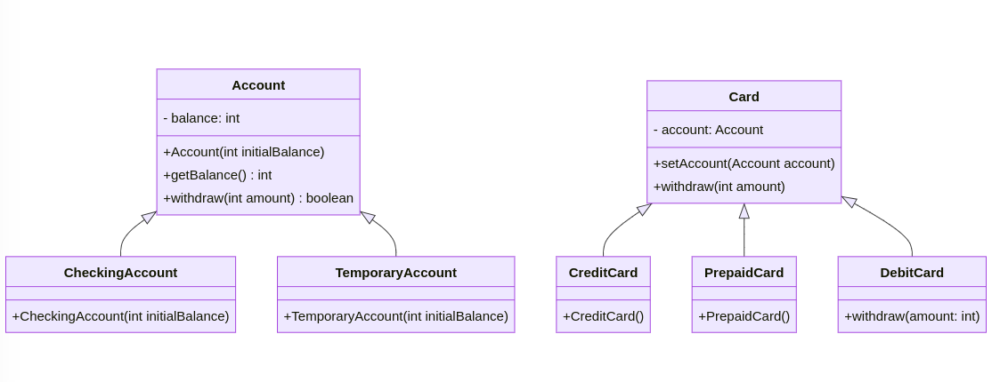
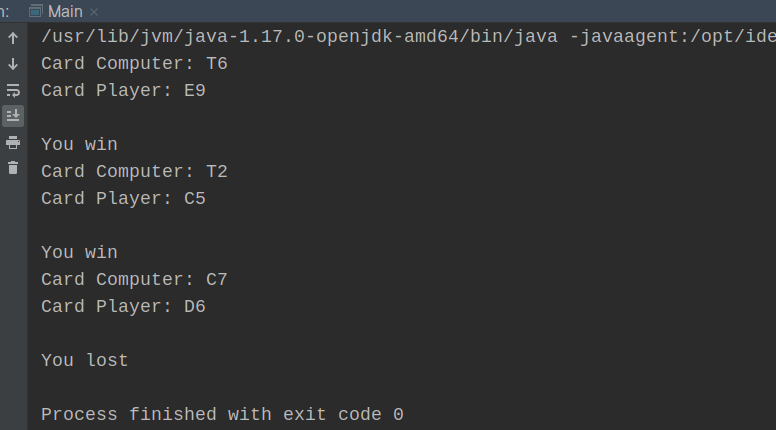

# Bank Santander - "Scratch and Win a Shopping Card" Campaign

The Bank Santander has received approval for its new campaign "Scratch and Win a Shopping Card," which introduces a new type of card to be implemented alongside the existing card types:

## Card Types:

1. **Credit Card**: Associated with a checking or fixed account, allows withdrawing an amount equal to or less than the approved limit by the bank.
2. **Debit Card**: Linked to a checking account, permits withdrawing an amount equal to or less than the associated account's balance.
3. **Prepaid Card**: Linked to a temporary account, allows withdrawing an amount equal to or less than the associated account's balance. Once the account balance reaches 0, it will be automatically disabled.

Any user or customer can purchase or win a prepaid card associated with a temporary account. The only difference is that when the account balance reaches 0, it will be automatically disabled.

## Exercise Overview:

Create a structure that manages the three types of accounts described above, as well as the cards, with a focus on the functionality of the prepaid card.

## Example and Output:

```java
Account c1 = new CheckingAccount(500);
Card t1 = new CreditCard();
t1.setAccount(c1);
t1.withdraw(50); // Output: c1.balance = 450

Account c2 = new CheckingAccount(100);
Card t2 = new CreditCard(500);
t2.setAccount(c2);
t2.withdraw(50); // Output: t2.balance = 450

Card t3 = new PrepaidCard();
Account c3 = new TemporaryAccount(100);
t3.setAccount(c3);
t3.withdraw(100); // Output: t3.balance = 0, c3.disabled
```
## Class diagram
```
---
title: Bank Santander
---
lassDiagram
    class Account {
        - balance: int
        + Account(int initialBalance)
        + getBalance(): int
        + withdraw(int amount): boolean
    }

    class CheckingAccount {
        + CheckingAccount(int initialBalance)
    }

    class TemporaryAccount {
        + TemporaryAccount(int initialBalance)
    }

    class Card {
        - account: Account
        + setAccount(Account account)
        + withdraw(int amount)
    }

    class CreditCard {
        + CreditCard()
    }

    class PrepaidCard {
        + PrepaidCard()
    }

    class DebitCard {
        + withdraw(amount: int)
    }

    Account <|-- CheckingAccount
    Account <|-- TemporaryAccount
    Card <|-- CreditCard
    Card <|-- PrepaidCard
    Card <|-- DebitCard
```


## Execution




