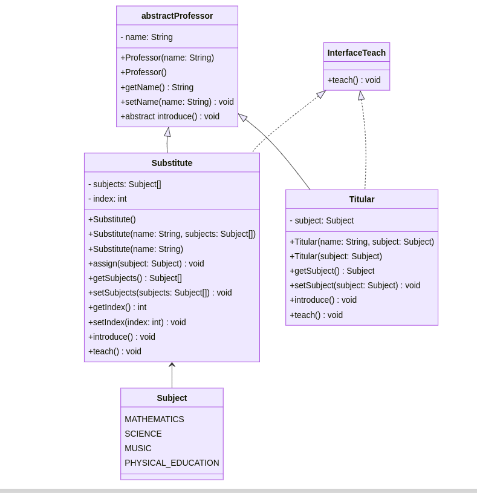
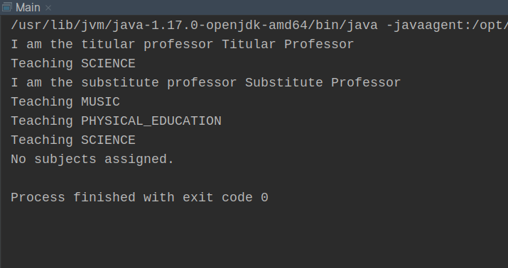

# The substitute teacher

The educational system has defined the categories of teachers for teaching, classified as follows:

### Categories
**Titular:** who is assigned to teach a subject for a defined contract period.

**Substitute or temporary:** who is assigned in case the regular teacher is not available.

## Exercise Overview:

Considering 4 subjects to be taught:** Mathematics, Science, Music, Gymnastics, a regular teacher can teach only one subject, but a substitute can teach any subject according to the need.

## Example and Output:

```java
Profesor titular = new Titular(CIENCIA)  // titular.ensenhar(); ->  "Dictando ciencia"

Profesor suplente = new Suplente();
suplente.asignar(CIENCIA);  // suplente.ensenhar() -> "Dictando ciencia"
suplente.asignar(GIMNASIA);  // suplente.ensenhar() -> "Dictando gimnasia"
suplente.asignar(MUSICA);  //suplente.ensenhar() -> "Dictando musica"
```
## Class diagram
```
---
title: The substitute teacher
---
classDiagram
    class abstract Professor {
        - name: String
        + Professor(name: String)
        + Professor()
        + getName(): String
        + setName(name: String): void
        + abstract introduce(): void
    }

    class Subject {
        MATHEMATICS
        SCIENCE
        MUSIC
        PHYSICAL_EDUCATION
    }

    class Interface Teach {
        + teach(): void
    }

    class Substitute {
        - subjects: Subject[]
        - index: int
        + Substitute()
        + Substitute(name: String, subjects: Subject[])
        + Substitute(name: String)
        + assign(subject: Subject): void
        + getSubjects(): Subject[]
        + setSubjects(subjects: Subject[]): void
        + getIndex(): int
        + setIndex(index: int): void
        + introduce(): void
        + teach(): void
    }

    abstract Professor <|-- Substitute
    abstract Professor <|-- Titular
    Substitute <-- Subject

    class Titular {
        - subject: Subject
        + Titular(name: String, subject: Subject)
        + Titular(subject: Subject)
        + getSubject(): Subject
        + setSubject(subject: Subject): void
        + introduce(): void
        + teach(): void
    }

    Interface Teach <|.. Substitute
    Interface Teach <|.. Titular
```


## Execution




